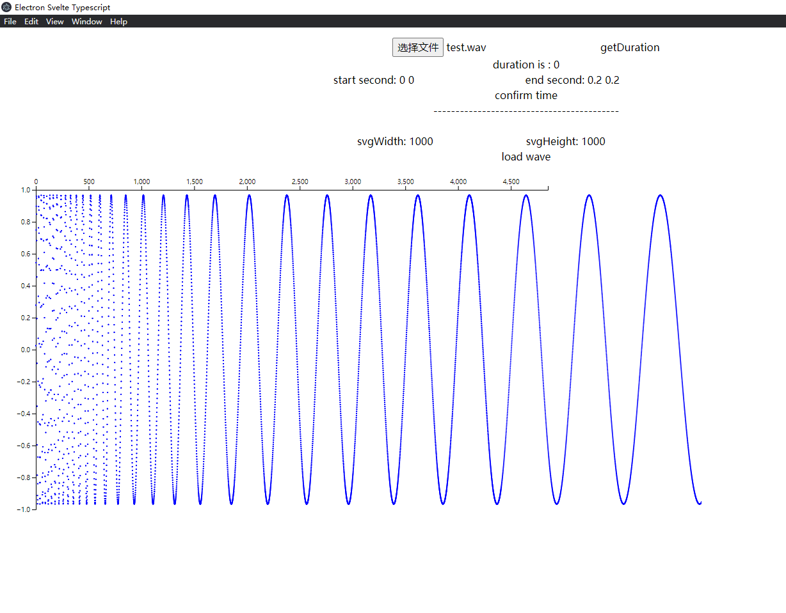
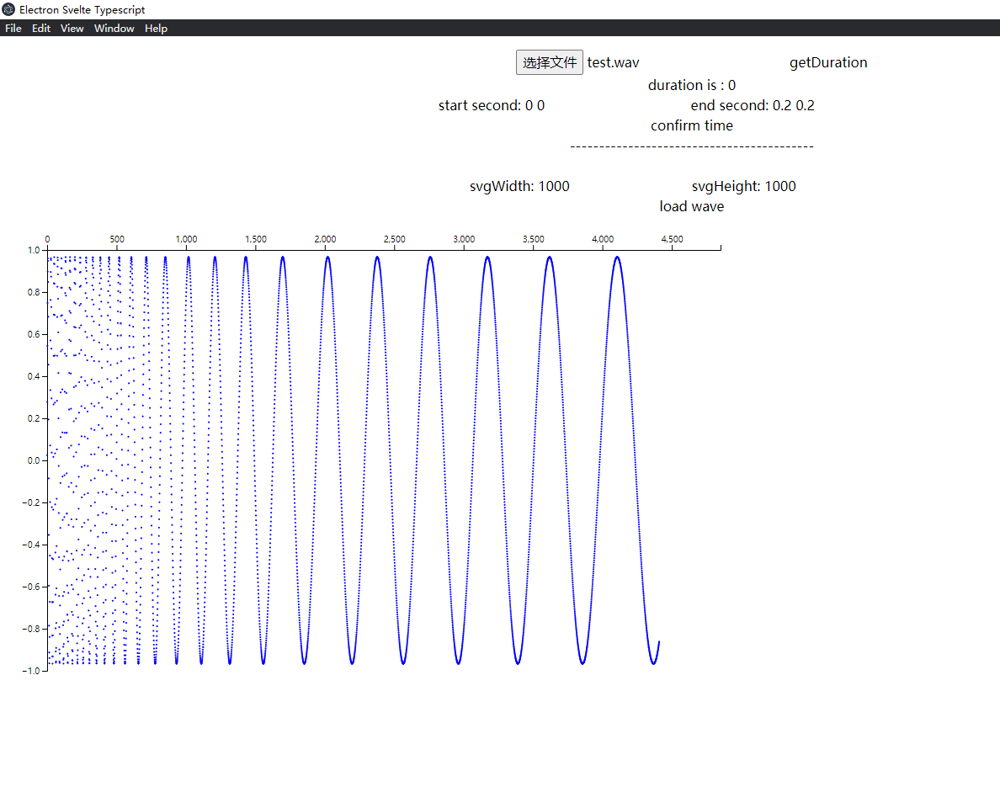

# 20220416
## package.json和package-lock.json
https://juejin.cn/post/7078233610683170824
后者固定版本号

# 20220417
## 选择es5而非es6的原因：es6在2015年刚出来，浏览器的支持不是很好，（但我做的是桌面应用：也可能改成浏览器版本……）
https://blog.csdn.net/weixin_42386551/article/details/111370285
https://www.jianshu.com/p/b2f544d7686e

## 主流js编译器——babel
https://juejin.cn/post/6844903781365186567

## v8引擎：为了更快地解析js脚本
[v8引擎与浏览器网页解析的原理](https://zhuanlan.zhihu.com/p/27628685)
[v8的性能优化技术——内联缓存](https://juejin.cn/post/6844904167333429256)

## v8引擎是js引擎（js编译器 plus）
如果需要用js/ts写桌面程序，主流写法两种
[electron或nw.js](https://www.jianshu.com/p/c6bdb087e60d)

## node.js是什么
node是一个软件，是一个js运行时环境（js不是c++这种系统语言，它是脚本语言，它的运行必须要依赖运行时环境，比如浏览器等），安装了node，就可以写js代码并run起来，node中核心的js引擎用的是google v8引擎
引擎： 负责整个JS程序的编译及执行过程
编译器： 负责语法分析及代码生成等工作
作用域： 收集并维护由所有声明的标识符（变量）组成的一系列查询，实施一套非常严格的规则， 确定当前执行的代码对这些标识符的访问权限
[js编译器，引擎，作用域](https://www.jianshu.com/p/36f5bfc6b7e6)

## 选择的前端框架，不是vue，而是svelte
[electron+svelte开发桌面程序](https://learnku.com/articles/45831)

[简介 / 添加数据 • Svelte 教程 | Svelte 中文网 (sveltejs.cn)](https://www.sveltejs.cn/tutorial/adding-data)

# 20220418

## [sing visualizer](https://github.com/weiijiie/singing-visualizer)
github已经有一个和我想做的差不多，但它是浏览器应用，我是桌面应用；而且他做的比较简单
但是现在后端网页他没有维护，所以我没法看它的运行情况

## js错误处理
```
try()
{
    do();
    //...
}
catch(e)
{
    console.log(e.name+" "+e.message);
    console.log(e.stack);
}
```

## js面向对象机制
js的面向对象使用function定义一个函数来实现

## js prototype原型对象，用于给对象增加属性或者方法
[prototype 原型链](https://www.runoob.com/js/js-object-prototype.html)

## js属性描述对象
```
{
  value: 123,
  writable: false,
  enumerable: true,
  configurable: false,
  get: undefined,
  set: undefined
}
```
seal和freeze冻结对象状态的修改
## js OOP
js 语言使用构造函数（constructor）作为对象的模板。所谓”构造函数”，就是专门用来生成实例对象的函数。它就是对象的模板，描述实例对象的基本结构。一个构造函数，可以生成多个实例对象，这些实例对象都有相同的结构。
var Vehicle = function () {
  this.price = 1000;
};

var ClassName=funciton(){
    this.prototype=xxx;
}
var test=new ClassName();

## js单线程
js引擎中，一个js脚本只能在一个单线程上运行

## 同步任务和异步任务
程序里面所有的任务，可以分成两类：同步任务（synchronous）和异步任务（asynchronous）。

同步任务是那些没有被引擎挂起、在主线程上排队执行的任务。只有前一个任务执行完毕，才能执行后一个任务。

异步任务是那些被引擎放在一边，不进入主线程、而进入任务队列的任务。只有引擎认为某个异步任务可以执行了（比如 Ajax 操作从服务器得到了结果），该任务（采用回调函数的形式）才会进入主线程执行。排在异步任务后面的代码，不用等待异步任务结束会马上运行，也就是说，异步任务不具有“堵塞”效应。

举例来说，Ajax 操作可以当作同步任务处理，也可以当作异步任务处理，由开发者决定。如果是同步任务，主线程就等着 Ajax 操作返回结果，再往下执行；如果是异步任务，主线程在发出 Ajax 请求以后，就直接往下执行，等到 Ajax 操作有了结果，主线程再执行对应的回调函数。

## 异步任务的调度，回调
首先，主线程会去执行所有的同步任务。等到同步任务全部执行完，就会去看任务队列里面的异步任务。如果满足条件，那么异步任务就重新进入主线程开始执行，这时它就变成同步任务了。等到执行完，下一个异步任务再进入主线程开始执行。一旦任务队列清空，程序就结束执行。

异步任务的写法通常是回调函数。一旦异步任务重新进入主线程，就会执行对应的回调函数。如果一个异步任务没有回调函数，就不会进入任务队列，也就是说，不会重新进入主线程，因为没有用回调函数指定下一步的操作。

JavaScript 引擎怎么知道异步任务有没有结果，能不能进入主线程呢？答案就是引擎在不停地检查，一遍又一遍，只要同步任务执行完了，引擎就会去检查那些挂起来的异步任务，是不是可以进入主线程了。这种循环检查的机制，就叫做事件循环（Event Loop）。维基百科的定义是：“事件循环是一个程序结构，用于等待和发送消息和事件（a programming construct that waits for and dispatches events or messages in a program）”。

## 异步的几种模式
### 回调函数

### 事件监听
https://wangdoc.com/javascript/async/general.html
https://www.sveltejs.cn/docs#Client-side_component_API

## svelte反应式值的更新
 Svelte 的反应性是由赋值语句触发的，因此使用数组的诸如 push 和 splice 之类的方法就不会触发自动更新。例如，点击按钮就不会执行任何操作。
解决该问题的一种方法是添加一个多余的赋值语句

# 20220421
## async await
async会返回一个promise对象
await会等待任意表达式的结果，如果await等待的是promise对象，则它会阻塞其后面的代码，等到promise对象resolve，然后得到resolve的值并返回
这就是 await 必须用在 async 函数中的原因。async 函数调用不会造成阻塞，它内部所有的阻塞都被封装在一个 Promise 对象中异步执行。

on:mousemove
## js事件分发：把一个封闭模块的数据传递给另一个封闭模块
dispatch等方法

dispatch在promise里面用到了type message, topic='xxx',这个不知道是什么用法


## 组件的转发
与 DOM 事件不同， 组件事件不会 冒泡（bubble） ，如果你想要在某个深层嵌套的组件上监听事件，则中间组件必须 转发（forward） 该事件。

## js箭头函数
valueH=(val)=>{"hello"+val};

# 20220422
## bind，组件绑定，可以通过获取当前时间戳来实现实时随机变色效果
## bind:value={valueName}
## bind:checked={value} 
bind冒号后面跟着的是本dom或者本组件需要的值/属性，它可以是值，如果本dom是类似于textarea等，可以是checked，如果本dom是一个复选框

## svelte组件的生命周期
### onMount
一个componet会被render到DOM上，on mount会在组件被渲染到DOM之上后
### onDestory
For example, we can add a setInterval function when our component initialises, and clean it up when it's no longer relevant. Doing so prevents memory leaks.
防止内存泄漏
### beforeUpdate 和 afterUpdate
顾名思义，beforeUpdate 函数实现在DOM渲染完成前执行。afterUpdate函数则相反，它会运行在你的异步数据加载完成后。

onMount生命周期在beforeUpdate和afterUpdate之间？

### tick函数

# 20220424
## 箭头函数，及其简写方法
https://www.cnblogs.com/fundebug/p/6904753.html

# 20220426
## electron
主进程+渲染进程，一个主进程+多个渲染进程，electron在本地创建了一个chromium引擎，用来跑所有的html/js，但是不同于浏览器，electron可以直接调用io.js，所以与底层操作系统有直接通信的能力
主进程使用 BrowserWindow 实例创建网页。每个 BrowserWindow 实例都在自己的渲染进程里运行着一个网页。当一个 BrowserWindow 实例被销毁后，相应的渲染进程也会被终止。
主进程管理所有页面和与之对应的渲染进程。每个渲染进程都是相互独立的，并且只关心他们自己的网页。
electron中，渲染进程（每个网页）无法直接调用本地GUI资源，而是需要用electron提供的IPC向主进程请求资源，主进程对本地资源进行调用
electron中，也提供了remote模块，用以rpc风格进行服务调用

## Electron 应用的目录结构
```
your-app/
├── package.json
├── main.js
└── index.html
```
package.json的格式和 Node 的完全一致，并且那个被 main 字段声明的脚本文件是你的应用的启动脚本，它运行在主进程上。你应`用里的 package.json 看起来应该像：
```
{
  "name"    : "your-app",
  "version" : "0.1.0",
  "main"    : "main.js"
}
```
注意：如果 main 字段没有在 package.json 声明，Electron会优先加载 index.js。

main.js 应该用于创建窗口和处理系统事件，一个典型的例子如下：
```
var app = require('app');  // 控制应用生命周期的模块。
var BrowserWindow = require('browser-window');  // 创建原生浏览器窗口的模块 https://www.requirejs-cn.cn/

// 保持一个对于 window 对象的全局引用，不然，当 JavaScript 被 GC，window 会被自动地关闭
var mainWindow = null;

// 当所有窗口被关闭了，退出。
app.on('window-all-closed', function() {
  // 在 OS X 上，通常用户在明确地按下 Cmd + Q 之前
  // 应用会保持活动状态
  if (process.platform != 'darwin') {
    app.quit();
  }
});

// 当 Electron 完成了初始化并且准备创建浏览器窗口的时候
// 这个方法就被调用
app.on('ready', function() {
  // 创建浏览器窗口。
  mainWindow = new BrowserWindow({width: 800, height: 600});

  // 加载应用的 index.html
  mainWindow.loadURL('file://' + __dirname + '/index.html');

  // 打开开发工具
  mainWindow.openDevTools();

  // 当 window 被关闭，这个事件会被触发
  mainWindow.on('closed', function() {
    // 取消引用 window 对象，如果你的应用支持多窗口的话，
    // 通常会把多个 window 对象存放在一个数组里面，
    // 但这次不是。
    mainWindow = null;
  });
});
```
有空可以研究下JS的gc：https://blog.csdn.net/szengtal/article/details/99488127

最后，你想展示的 index.html ：
```
<!DOCTYPE html>
<html>
  <head>
    <title>Hello World!</title>
  </head>
  <body>
    <h1>Hello World!</h1>
    We are using io.js <script>document.write(process.version)</script>
    and Electron <script>document.write(process.versions['electron'])</script>.
  </body>
</html>
```

# 20220427
## git原理——快照的实现 
维护一个树形结构，每个修改的diff为树上的一个节点<br>
[git深入教程——解决冲突](https://www.yiibai.com/git/git_handling_conflicts.html)

## 模块是独立的文件，该文件内部的所有的变量外部都无法获取。如果希望获取某个变量，必须通过export输出
为了让Node.js的文件可以相互调用，Node.js提供了一个简单的模块系统。
模块是Node.js 应用程序的基本组成部分，文件和模块是一一对应的。换言之，一个 Node.js 文件就是一个模块，这个文件可能是JavaScript 代码、JSON 或者编译过的C/C++ 扩展。

## typescript是js的超集
1. 需要先用tsc(ts compiler把ts文件编译成js文件)
2. typescript最重要的:显式类型声明,

进度:https://www.w3cschool.cn/typescript/typescript-tutorial.html

# 20220505
## complier options
script defer关键字：延迟script的加载
## npm范围包
@babel/preset-env
@组织名/包名
这个@babel是npm中的范围包，和公共包一样是个包

# 20220506
## svelte中的promise和await
promise的完成是一个promise链条上的一环，它完成后才开始下一环
（Basically, each promise represents the completion of another asynchronous step in the chain.）
## 变量提升
将当前作用域的所有变量的声明，提升到程序的顶部，因此，上面的代码等价于以下代码，这样是不是就能明白一些了？
变量提升只提升声明语句，不提升赋值语句，所以如果声明+赋值，则只提升了声明，仍然是undefined

当函数声明与其他声明一起出现的时候，是以谁为准呢？答案就是，函数声明高于一切
有多个函数声明的时候，是由最后的函数声明来替代前面的。

# 20220511
前端框架与css框架的概念区别
https://www.zhihu.com/question/304757674


## 技术选型：ui库的选择
因为已经确定选择了svelte这个前端框架，所以需要配合一个css库/ui组件库来使用，搜到了：
https://www.jdon.com/56558

1. Svelte Material UI
Material 是谷歌的 UI 设计系统。Svelte Material UI 以预制Svelte 组件的形式为您提供此设计系统。如果您喜欢扁平化设计并且是 Material 的忠实粉丝，那么您一定会喜欢 Svelte Material UI！

2. Carbon Components Svelte
Carbon 是IBM 的开源设计系统。Carbon Components Svelte 将这个有趣的设计系统的力量带到了 Svelte。
Carbon 现在可能和其他设计系统一样流行，但它绝对是一个有趣的系统。如果你不想走主流路线，那就试试吧！

3. Smelte
Smelte 是 Google Material Design 在 Svelte 和 Tailwind 之上的另一种实现。Smelte 绝对是 Svelte Material UI 的不错替代品，特别是如果您喜欢 Tailwind 的易用性。Smelte 与它很好地集成在一起，并允许您使用 Tailwind 技能来即时改变样式。

4. Svelteit
Svelteit 是一个简约的 UI/UX 组件库。它没有遵循特定的设计语言，但仍然具有很好的风格。Svelteit 的简约方法绝对值得一试。它是轻量级的，足以创建漂亮的 UI！

5. Attractions
Attractions 是 Svelte 的时尚且实用的 UI 套件。它完全可以使用 Sass 进行样式化！整体风格不是您今天经常看到的通常的平面设计。它在必要时增加了深度，同时又不会变得太好玩。

[svelte原理与测评](https://juejin.cn/post/7044387319352131597)

[另一个electron svelte template](https://github.com/codediodeio/electron-forge-svelte/blob/master/package.json)

temp:
https://learnku.com/articles/45831
https://learnku.com/articles/45833

# 20220515
## cnnexplainer
tensorflow.js作为gpu加速推理预训练的模型
svelte：前端框架
d3.js：交互式操作

## DOM技术
文档对象模型指的是把文档、每个标签等都变成对象，这样方便直接对它们当成一个对象元素进行操作

# 20220519
## 转录，mel频谱图深入理解
https://zhuanlan.zhihu.com/p/198900624

## 梅尔刻度
https://zhuanlan.zhihu.com/p/421460202

## fft与信号加窗
https://blog.csdn.net/AnimateX/article/details/80532376
https://blog.csdn.net/s09094031/article/details/105744859

## fft点和采样频率
https://blog.csdn.net/weixin_34382015/article/details/116122375

# 20220520
## d3版本问题
test.svelte中原本的代码d3 v3的代码，然而升级到v5后，很多api名字都变了，所以进行修改

# 20220521
## fft in js
https://zhuanlan.zhihu.com/p/197450738

## ts类型别名
TypeScript 提供了为类型注解设置别名的便捷语法，你可以使用 type SomeName = someValidTypeAnnotation 来创建别名：
```
type StrOrNum = string | number;

// 使用
let sample: StrOrNum;
sample = 123;
sample = '123';

// 会检查类型
sample = true; // Error
```

## 是改造dsp.js，还是electron+python前后端通信？
选择了后者：
https://zhuanlan.zhihu.com/p/36356443

前者已经不再维护

to see
https://www.cnblogs.com/cc11001100/p/14290450.html
https://www.cnblogs.com/feng0815/p/14490087.html
https://jkchao.github.io/typescript-book-chinese/typings/migrating.html#%E7%AC%AC%E4%B8%89%E6%96%B9%E4%BB%A3%E7%A0%81

python flask restful 设置不同路由
electron主线程访问这些本地路由，得到处理过的librosa数据。网络net模块还是原生nodejs
python脚本可以访问本地音频文件，nodejs可以吗？渲染线程肯定不可以，主线程可以吗

## electron的net模块访问外部网络，还是用原生nodejs
## 最终项目架构
前端：svelte前端框架组件库+d3 css样式及交互效果，electron打包成桌面应用
后端：logic和stores中的ts文件
音频处理：python+librosa处理，python flask restful提供网络访问接口，由svelte组件中的js直接访问

## 需要一个electron或者node或者ts能够访问网络或者rpc服务的库，然而got库会报错'node_events is not defined'
https://github.com/sindresorhus/got/blob/main/documentation/tips.md#electron-net-module-is-not-supported

## 如果是python程序跑在6000端口，会报错 不安全端口
https://blog.csdn.net/testcs_dn/article/details/39186225
所以避开这些端口，用了6005

to see：
https://www.sveltejs.cn/tutorial/spread-props

# 20220522
## flask 快速入门
http://www.pythondoc.com/flask/quickstart.html

# 20220523
## 前后端传输编码解码
https://blog.csdn.net/oopxiajun2011/article/details/117123843

## d3 配色方案——配合二位数组，散列化颜色强度值
https://juejin.cn/post/7046618971021246501

## librosa音频信号处理
https://www.jianshu.com/p/8d6ffe6e10b9

## d3二维数组绘图教程
https://blog.csdn.net/zjw_python/article/details/98182540
https://blog.csdn.net/romeo12334/article/details/83308383

# 20220524
## d3颜色插值两种方法：线性插值、阈值插值
https://www.jianshu.com/p/b757a22a9aad

## 目前设计的主要模块：
case1： 波形、过零率、频谱质心、knn
case2： 波形、频谱图、cnn

上传文件、获取总时长，用户输入她希望的起始秒和结束秒，后续操作将会在这些秒内的音频采样点上处理

# 20220525
## svelte响应式声明
https://blog.csdn.net/ramblerviper/article/details/124923052
// function printfile(){
//         $: if ( $filePath.length != 0) {
//         console.log($filePath);
//     }
// }


## 开发bug testwave.svelte
bug描述：先输入一个大的end second，画完图，再输入一个小的，更新画图
则小的end second画出来的图自动被拉宽了，圆点和x轴的刻度无法对应
但如果是先输入小的，画图；再输入大的画图，则更新并没有问题



## librosa音频分析
https://blog.csdn.net/qq_44250700/article/details/119685358

# 20220526
## svelte 下拉框多选
https://www.sveltejs.cn/tutorial/multiple-select-bindings

# 20220527
## d3.js 交互


# 20220530
## smelte bug
所有的component的css表都没有用到smelte相关，global.css也没有用过，但是如果删除在rollup.js种smelte的plugin声明部分，就会出现样式奇怪的情况
等所有功能组件都写好后，把smelte的这个部分重新搞一下

# 20220531
## 播放音频和d3画line并transmission不同步的问题
依靠延时？

## todo
1. 傅里叶变换
2. 修复播放同步的bug
3. 组件的复杂交互